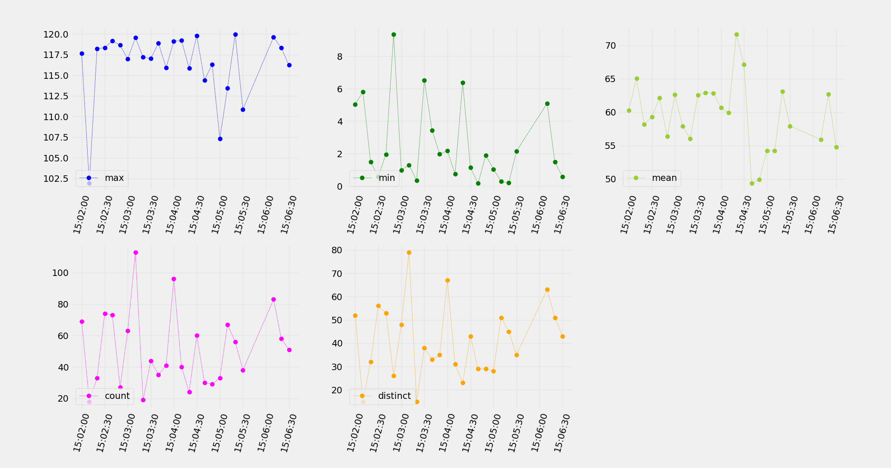

# Stream DaQ

Remember the joy of bath time with those trusty rubber ducks, keeping us company while floating through the bubbles?
Well, think of **Stream DaQ** as the duck for your data — keeping your streaming data clean and afloat in a sea of
information. Just like those bath ducks helped make our playtime fun and carefree, Stream DaQ keeps an eye on your data
and lets you know the moment things get messy, so you can take action ***in real time***!

<p align="center">
    
</p>

## The project

**Stream DaQ** is originally developed in Python, leveraging internally
the [Pathway](https://github.com/pathwaycom/pathway) stream processing library, which is an open source project, as
well. Previous versions of the project were featuring more Python stream processing libraries,
namely [Faust](https://faust-streaming.github.io/faust/) and [Bytewax](https://bytewax.io/). You can find source code
using these frameworks in the `faust-vs-bytewax` branch of the repository. Comparisons between the two libraries are
also available there. Our immediate plans is to extend the functionality of Stream DaQ primarily in Pathway. The latest
advancements of the tool will always be available in the `main` branch (you are here).

The project is developed by the Data Engineering Team (DELAB) of [Datalab AUTh](https://datalab.csd.auth.gr/), under the
supervision of [Prof. Anastasios Gounaris](https://datalab-old.csd.auth.gr/~gounaris/).

## Key functionality

**Stream DaQ** keeps an eye on your data stream, letting you know when travelling data are not as expected. In **real
time**. So that you can take actions. There are several key aspects of the tool making it a powerful option for data
quality monitoring on data streams:

1. *Highly configurable*: Stream DaQ comes with plenty of built-in data quality measurements, so that you can choose
   which of them fit your use case. We know that every data-centric application is different, so being able to **define
   ** what "data quality" means for you is precious.
2. *Real time alerts*: Stream DaQ defines highly meaningful data quality checks for data streams, letting the check
   results be a stream on their own, as well. This architectural choice enables real time alerts, in case the standards
   or thresholds you have defined are not met!

<p align="center">
    
</p>

## Example code

Data quality monitoring is a highly case-specific task. We feel you! That's why we have tried to make it easier than
ever to define what data quality means to your *very own case*. You just need a couple of lines to define what you want
to be monitored and that's it! Sit back, and focus on the important stuff; the **real time** results. Stream DaQ
reliably handles all the rest for you. See it in a toy example!

```python
from StreamDaQ import StreamDaQ
from DaQMeasures import DaQMeasures as measures

daq = StreamDaQ()

daq.add(measures.count('items'), "count") \
    .add(measures.min('items'), "min") \
    .add(measures.median('items'), "std") \
    .add(measures.most_frequent('items'), "most_frequent") \
    .add(measures.number_of_distinct('items'), "distinct") \

daq.watch_out()
```

In this simple example, we define four different measurements:

- the number of elements (`count`)
- their minimum (`min`)
- their median (`median`)
- their standard deviation (`std_dev`)
- the most frequent values (`most_frequent`)
- the number of distinct values (`number_of_distinct`)

The above data quality measures are monitored and reported in real time for every window of the stream.
After defining them, Stream DaQ takes over to continuously monitor (`watch_out`) the stream, as new data arrive.
The monitoring results are reported in real time, as a meta stream. That is, every row of the result is a new stream
object itself, as following:

```markdown
window_start | count | min | median | most_frequent | distinct
18:06:40     | 12    | 1   | 5.5    | (9, 1)        | 7
18:07:00     | 3     | 4   | 7      | (4, 7)        | 3
18:07:20     | 17    | 1   | 5      | 3             | 10
18:07:40     | 9     | 1   | 3      | (3, 1)        | 7
  .             .      .     .           .            .
  .             .      .     .           .            .
  .             .      .     .           .            .
```

The above measurements are just a small subset of the large amount of built-in measurements ready-for-use. A detailed 
list of all the available measurements will be included shortly.

## Execution

The easiest way to run the code in this repository is to create a new conda environment and install the required
packages. To do so, execute the following commands in a terminal:

   ```bash
   conda env create --file environment.yml
   conda activate daq
   pip install -r requirements.txt
   ```

The above three commands are required only the *first* time you run the code. For every next run, simply activate
the conda environment `daq`:

   ```bash
   conda activate daq
   ```

and then follow the following steps:

1. Starting from the root folder of the project, go to the `pathway` directory.
   ```bash
   cd pathway
   # all the commands from now on should be executed in this directory
   ```
1. Run the `main` file
    ```bash
    python main.py
    ```

## Work in progress

The project is in full development at current time, so more functionalities, documentation, examples and demonstrations
are on their way to be included shortly. We thank you for your patience.

## Acknowledgements

Special thanks to [Maria Kavouridou](https://www.linkedin.com/in/maria-kavouridou/) for putting effort and love, in
order to give birth to the Stream DaQ logo.

